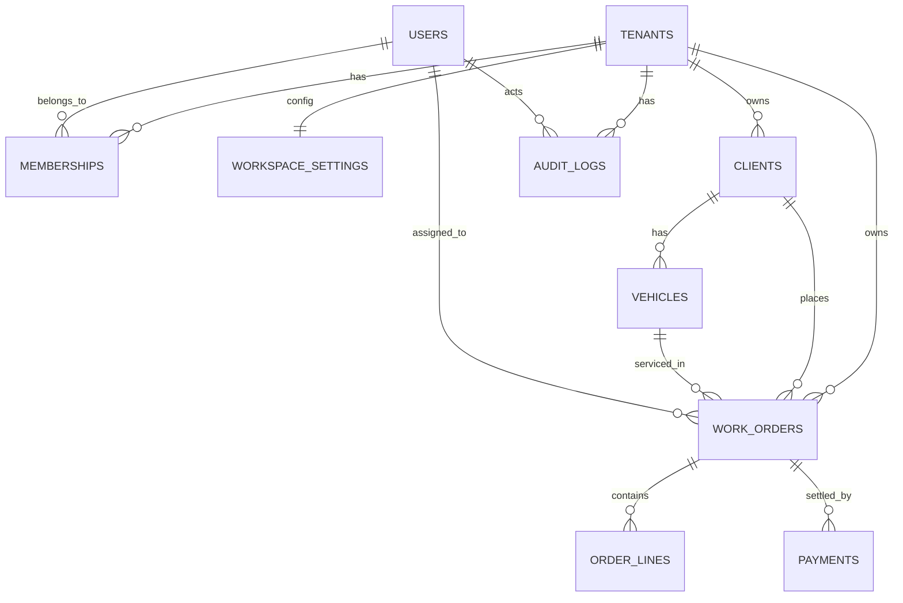

# AutoService CRM SaaS - Canonical MVP Domain Model

**Status:** Canonical MVP domain baseline (post runtime simplification)  
**Date:** 2026-03-13  
**Scope:** SaaS MVP only (no desktop, no deferred platform runtime)

## 1. Domain baseline and decisions
This model is the canonical business contract for MVP completion. It is intentionally strict and excludes deferred SaaS platform areas (subscription, billing platform, webhooks, API keys, internal tenant ops, presentation/admin runtime).

### Locked decisions
1. **Vehicle is a first-class MVP entity** (not embedded under Client). One client can own multiple vehicles; work orders must target a concrete vehicle.
2. **Payment should be a first-class MVP entity** in minimal form. Current "pay" behavior via order status is not enough for operational cash reconciliation and will cause API churn.
3. **Employee remains a separate domain concept from User**, but no separate table is required now. Employee = workspace-scoped projection of `User + Membership`.
4. **Order Line and Labor Line should be one entity in MVP**: `OrderLine` with `line_type` (`labor`, `part`, `misc`) to avoid over-modeling.
5. **Workspace/Tenant naming must be normalized**: `workspace` in API/UI contract, `tenant` for storage internals.

## 2. Canonical MVP entities

### 2.1 Workspace (Tenant)
- Purpose: Isolation boundary for all operational data.
- Required fields: `id`, `name`, `slug`, `state`, `created_at`, `updated_at`.
- Optional fields: none for MVP.
- Relationships: 1..N with Membership, Client, Vehicle, WorkOrder, Payment, AuditLog; 1..1 with WorkspaceSettings.
- Lifecycle/status: `active`, `suspended`, `disabled`, `deleted`.
- Implementation status: **Implemented**.

### 2.2 User (Identity)
- Purpose: Global authentication principal (email/password).
- Required fields: `id`, `email`, `password_hash`, `is_active`, `created_at`.
- Optional fields: none for MVP.
- Relationships: N..M to Workspace through Membership; 1..N AuditLog.
- Lifecycle/status: `is_active` boolean.
- Implementation status: **Implemented**.

### 2.3 Membership (Employee-in-workspace)
- Purpose: Workspace-scoped role assignment for a user.
- Required fields: `id`, `user_id`, `tenant_id`, `role`, `version`, `created_at`, `updated_at`.
- Optional fields: none for MVP.
- Relationships: belongs to User and Workspace.
- Lifecycle/status: role in `{owner, admin, manager, employee}`; optimistic versioning.
- Implementation status: **Partially implemented** (service layer exists; API surface incomplete; migration enum mismatch for `manager`).

### 2.4 Role/Permission model
- Purpose: Authorization for workspace operations.
- Required fields: role + resource/action permission matrix.
- Optional fields: none for MVP.
- Relationships: Membership.role drives permissions.
- Lifecycle/status: static policy in MVP.
- Implementation status: **Partially implemented / inconsistent** (backend and frontend permission namespaces diverge).

### 2.5 Client
- Purpose: Service customer profile.
- Required fields: `id`, `tenant_id`, `name`, `phone`, `version`, `created_at`, `updated_at`.
- Optional fields: `email`, `comment`, `deleted_at`.
- Relationships: 1..N Vehicle; 1..N WorkOrder.
- Lifecycle/status: active, soft-deleted (`deleted_at`).
- Implementation status: **Implemented**.

### 2.6 Vehicle
- Purpose: Physical unit being serviced; links operations to a concrete car.
- Required fields: `id`, `tenant_id`, `client_id`, `plate_number`, `make_model`, `created_at`, `updated_at`.
- Optional fields: `year`, `vin`, `comment`, `archived_at`.
- Relationships: belongs to Client and Workspace; 1..N WorkOrder.
- Lifecycle/status: active, archived.
- Implementation status: **Missing**.

### 2.7 WorkOrder (Order)
- Purpose: Operational service order.
- Required fields: `id`, `tenant_id`, `client_id`, `vehicle_id`, `status`, `total_amount`, `created_at`, `updated_at`.
- Optional fields: `assigned_user_id`, `notes`.
- Relationships: belongs to Client, Vehicle, Workspace; optional assignee User; 1..N OrderLine; 1..N Payment.
- Lifecycle/status: `new`, `in_progress`, `completed`, `canceled`.
- Implementation status: **Partially implemented** (exists as `Order` but lacks `vehicle_id`, `assigned_user_id`, and line/payment linkage; uses `price` scalar).

### 2.8 OrderLine (includes labor line)
- Purpose: Itemized composition of work order total.
- Required fields: `id`, `tenant_id`, `order_id`, `line_type`, `name`, `quantity`, `unit_price`, `line_total`, `position`, `created_at`.
- Optional fields: `comment`.
- Relationships: belongs to WorkOrder.
- Lifecycle/status: mutable until order completion/cancel.
- Implementation status: **Missing**.

### 2.9 Payment
- Purpose: Financial settlement record for work orders.
- Required fields: `id`, `tenant_id`, `order_id`, `amount`, `paid_at`, `method`, `created_by_user_id`, `created_at`.
- Optional fields: `comment`, `external_ref`, `voided_at`.
- Relationships: belongs to WorkOrder and Workspace; creator User.
- Lifecycle/status: `posted` (and optional `voided`).
- Implementation status: **Missing** (current flow simulates payment via order status update).

### 2.10 AuditLog
- Purpose: Traceability of business and access events.
- Required fields: `id`, `tenant_id`, `user_id`, `action`, `entity`, `created_at`.
- Optional fields: `entity_id`, `metadata`.
- Relationships: belongs to Workspace and User; references business entities by (`entity`, `entity_id`).
- Lifecycle/status: append-only.
- Implementation status: **Implemented**.

### 2.11 WorkspaceSettings (Basic service settings)
- Purpose: Basic service profile used by operations UI.
- Required fields: `tenant_id`, `service_name`, `phone`, `timezone`, `currency`, `updated_at`.
- Optional fields: `address`, `working_hours_note`.
- Relationships: 1..1 with Workspace.
- Lifecycle/status: mutable by owner/admin.
- Implementation status: **Missing**.

## 3. Mermaid ER diagram (canonical MVP)

## 4. Consistency review

### Implemented correctly
- Workspace/Tenant core (`tenants`, tenant state in model/runtime).
- User identity (`users`).
- Client CRUD + soft-delete + optimistic version.
- Order base CRUD/status flow (without vehicle/line/payment semantics).
- Audit log persistence and read APIs.
- Tenant-scoped repository pattern and request-context isolation.

### Partially implemented
- Employee domain: service has create/list/update/delete logic, but active controller exposes only create and is named `/users`.
- Role/permission: role set supports `manager` in runtime code, but DB migration enum does not include it.
- WorkOrder semantics: current model is single `description + price`; lacks canonical work-order structure.

### Missing
- Vehicle entity and APIs.
- Payment entity and APIs.
- OrderLine entity and APIs.
- WorkspaceSettings entity and APIs.
- Order linkage fields required by MVP (`vehicle_id`, optional `assigned_user_id`, `total_amount` contract).

### Rename/restructure recommended
- Public API naming: `/users` -> `/employees` (or explicit alias strategy).
- Domain term: `Order` -> canonical `WorkOrder` in API/docs, keep storage compatibility as needed.
- Money field: `price` -> `total_amount` on work order boundary.
- Payload naming: normalize workspace-facing APIs to `workspace*` while keeping `tenant_id` internal.
- Audit DTO: align `workspace_id`/`tenant_id` naming through one stable API convention.

### Can remain deferred
- Plans/subscriptions/usage counters/billing events/feature overrides.
- API keys, webhooks, external API, internal tenant control endpoints.
- Integration credentials and related integration adapters.

## 5. High-risk inconsistencies to fix before API completion
1. `MembershipRole` migration enum missing `manager` value while code and frontend use it.
2. Employee API domain named as users (`/users`, `user_id`) instead of employees.
3. Backend RBAC resource namespace (`work_orders`) differs from frontend namespace (`orders.*`, `finance.*`, `workspace.settings.*`).
4. Payment action exists in frontend (`/orders/{id}/pay`, `finance.create_payment`) but no Payment entity in backend domain.
5. Workspace/Tenant naming is mixed across DTOs and controllers (`tenant_id`, `workspace_id`, `workspaceId`) without canonical contract.

## 6. MVP canonical boundary for implementation phase
The canonical MVP domain set to drive backend/frontend completion is:
- Workspace
- User
- Membership (Employee-in-workspace)
- Role/Permission matrix
- Client
- Vehicle
- WorkOrder
- OrderLine
- Payment
- AuditLog
- WorkspaceSettings

Deferred entities stay out of MVP runtime and out of MVP API contracts.
